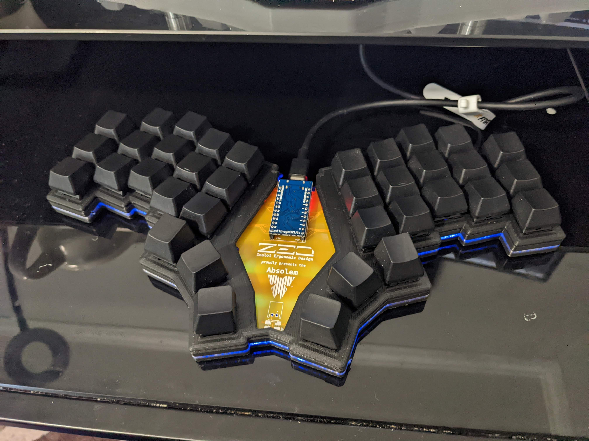
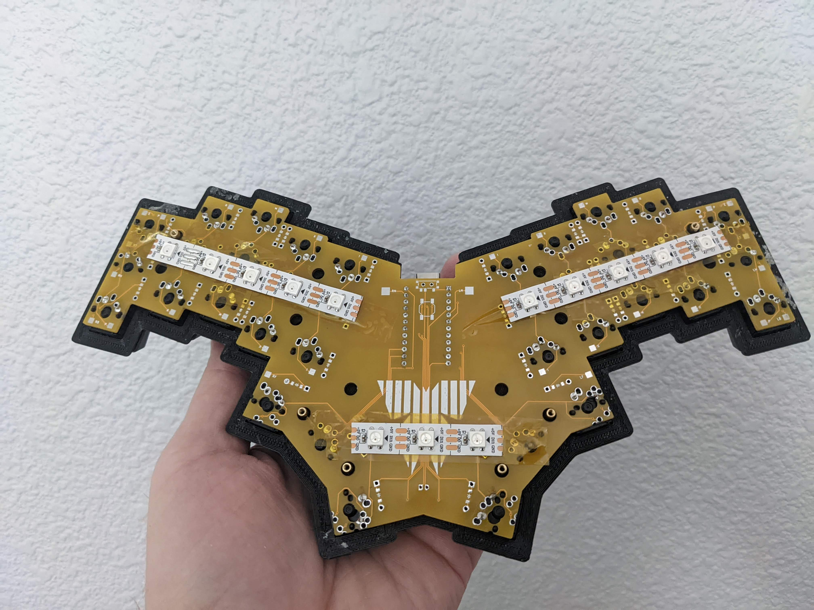
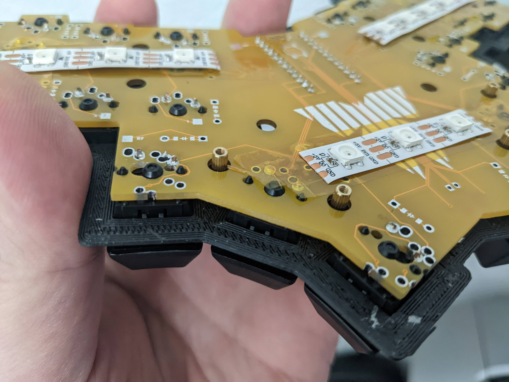
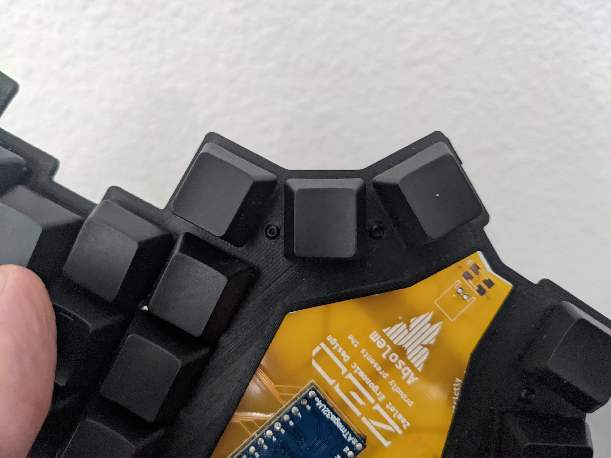
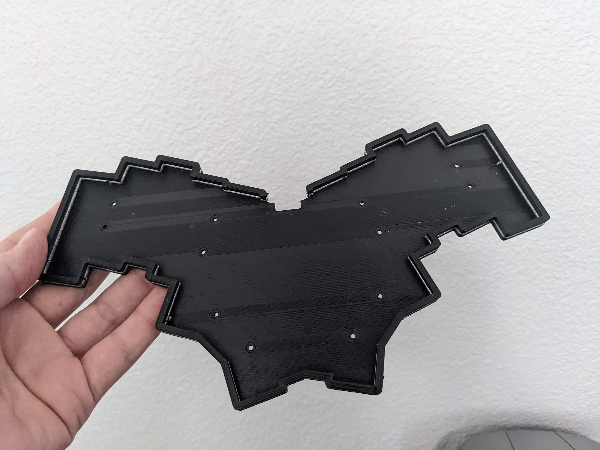
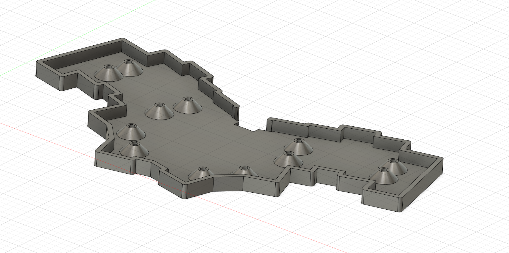

# Absolem case

## Plated case (plateless below)

Just a simple case for the [Absolem](https://github.com/mrzealot/absolem). Note that this is MX only.

### BOM
* 4mm M2 screws
* M2 standoffs, 6mm for the small body stl, 8-9mm for the tall body stl
* Printed case and switchplate
* Absolem pcb and all the parts required for it (diodes, switches, etc)

### Instructions

* Print either the body.stl or the body-tall.stl. The only difference between the two is the height of the body. The body.stl leaves no room below the pcb, so if you want a low profile case, use this one. However, if you plan on putting LED strips under, or adding anything that requires a gap, then use body-tall.stl.
* Print the switchplate
* Solder everything onto the board except for the switches
* Place the switches into the plate in the correct directlion (corresponding to the footprint on the pcb)
* Put the M2 screws through the holes in the switchplate, and screw the standoffs into them
* Put the switchplate into the pcb with the switches
* Solder the switches. This will permanently attach the switchplate to the pcb via the switches. You can undo it, but you have to desolder the switches to do so
* Put the switchplate / pcb into the case, and screw into the standoffs from the bottom of the case. You're done!

### Pictures

## Plateless case

This is a case that allows you to mount the pcb directly without a plate

### BOM
* 12 M3 heat set inserts, 4mm length
* 12 M3 wafer head screws, 3-4mm length, 4 preferred. Screw head should be 5mm in diameter. Note that a 5mm screw head may interfere with the switch housing, but the absolem holes are 4.5mm. You will need to get a bit creative while screwing them in.
* (optional) 12 M3 rubber or nylon washers, should be 5mm in diameter
* Printed case
* Absolem pcb and all the parts required for it (diodes, switches, etc)

### Instructions

* Print either the 6mm or 9mm case
** If you plan on using underglow, or putting a battery under the pcb, use the 9mm case. Otherwise, the 6mm case is nice for a lower profile keyboard
* Unlike the plated case, you can solder everything onto the pcb, since you don't have to worry about a switch plate
* Once the case is ready, put the M3 heat set inserts into the case
* Place the pcb onto the case
* One by one, put a washer onto each hole in the pcb and screw one of the M3 screws into the heat set insert in the case

You're done!

