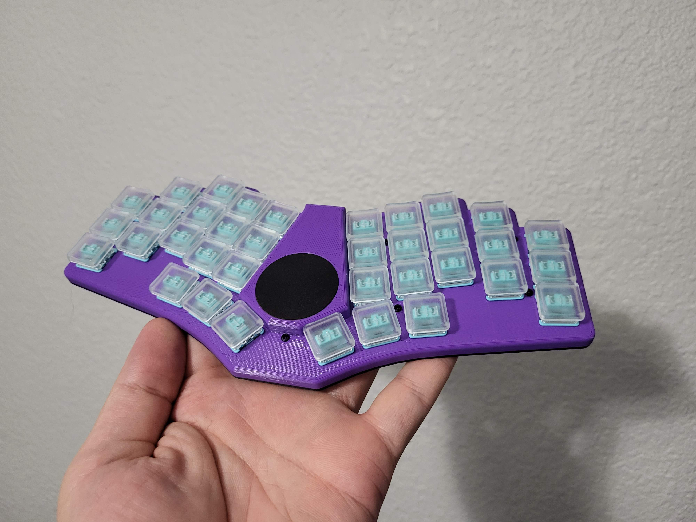

Case for the [Bad Wings](https://github.com/jasonhazel/qmk_hazel/tree/master/keyboards/jasonhazel/bad_wings)

QMK: https://github.com/jasonhazel/qmk_hazel/tree/master/keyboards/jasonhazel/bad_wings
ZMK: https://github.com/jasonhazel/zmk-bad_wings

## Case build

* 9x - 4mm or 5mm M2 standoffs
* 18x - 4mm M2 screws
* 1x - bad-wings-body.stl (4mm for non-hotswap, 5mm for hotswap)
* 1x - bad-wings-bottom-plate.stl

## Pictures

