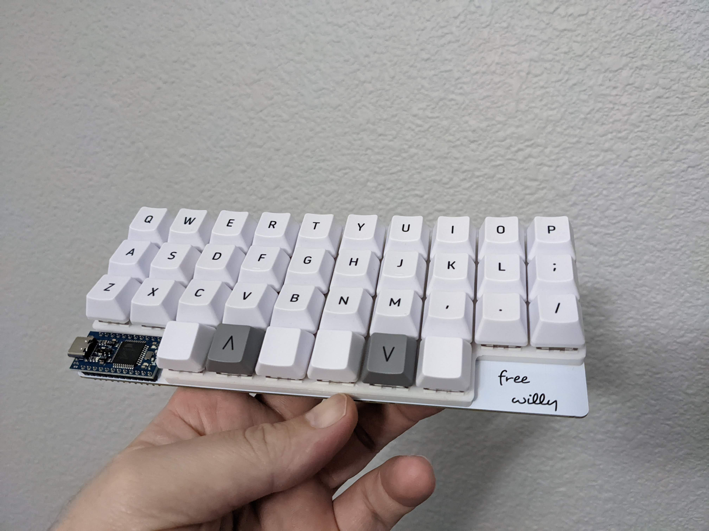
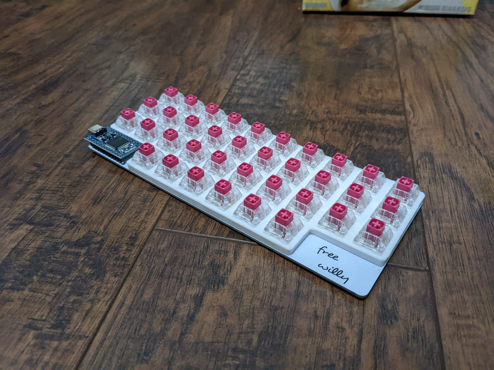
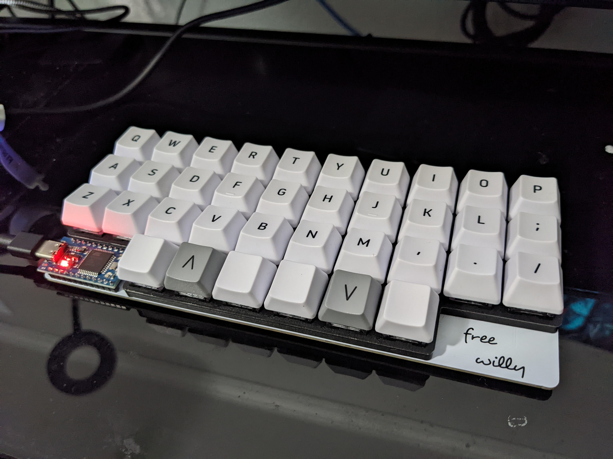

Case for the [Free Willy](https://www.squashkb.com/product/free-willy)

# Instructions

Note: Typically the free willy only supports pcb mounted switches. With this plate, you can use plate mounted switches, since the plate will align the switches for you to solder.

* Print the plate
* Place switches into the plate
* Place the plate with the switches into the pcb
* Solder!

# Images

