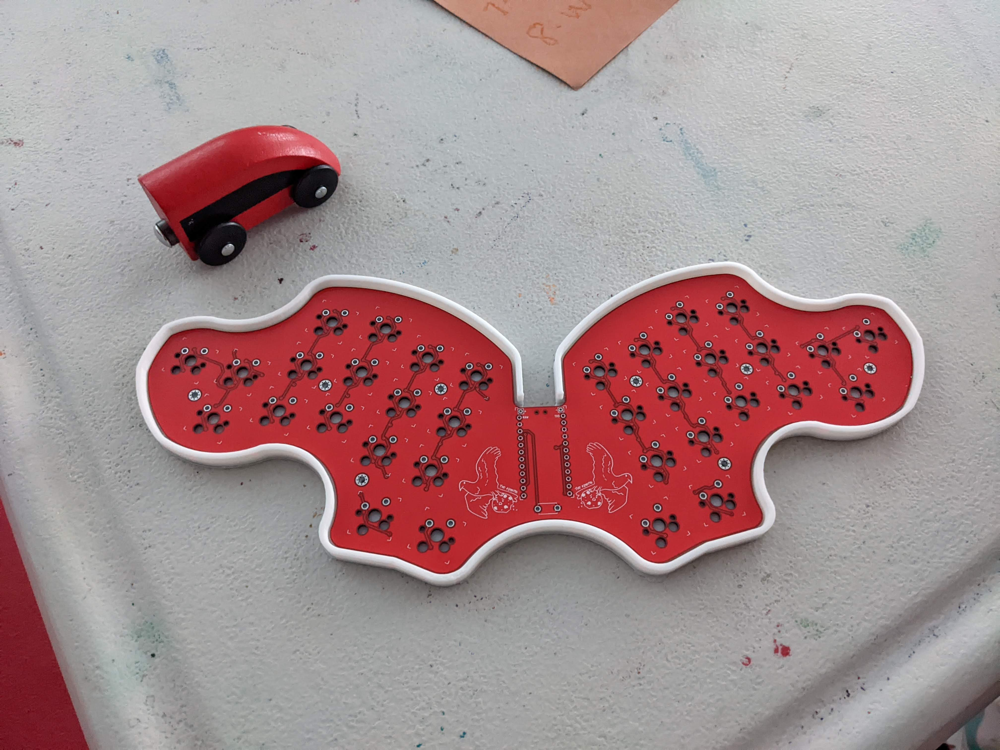
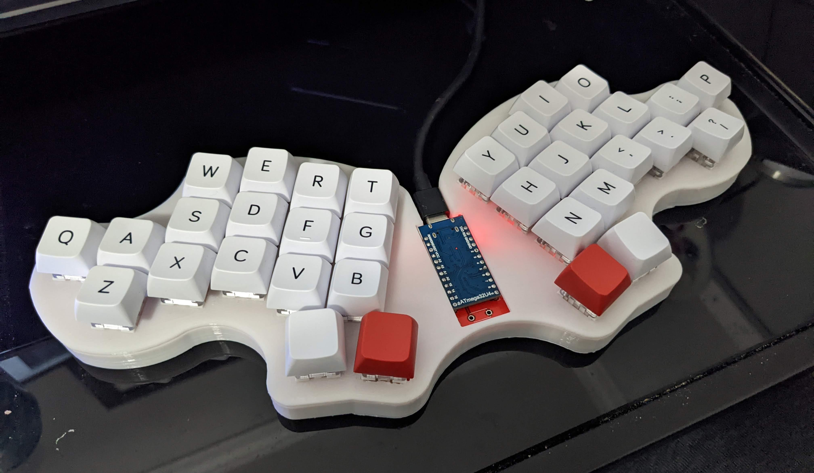

Case for the [Osprette MX](https://github.com/smores56/osprette-mx)

# Parts for case

* printed case
* (plate version) printed plate
* (plate version) 8 m2 screws, 14mm
* (no plate version) 8 m2 screws, 10mm
* 8 m2 nuts

# Instructions

There are two ways to use this, with and without the plate.

* solder everything onto the pcb except the switches
* (plate only) print the plate and case
* (plate only) put the switches into the plate
* solder the switches to the pcb
* place the pcb into the case
* put the screws through the pcb/plate through the bottom holes
* screw the nuts onto the exposed screws at the bottom

# Images

