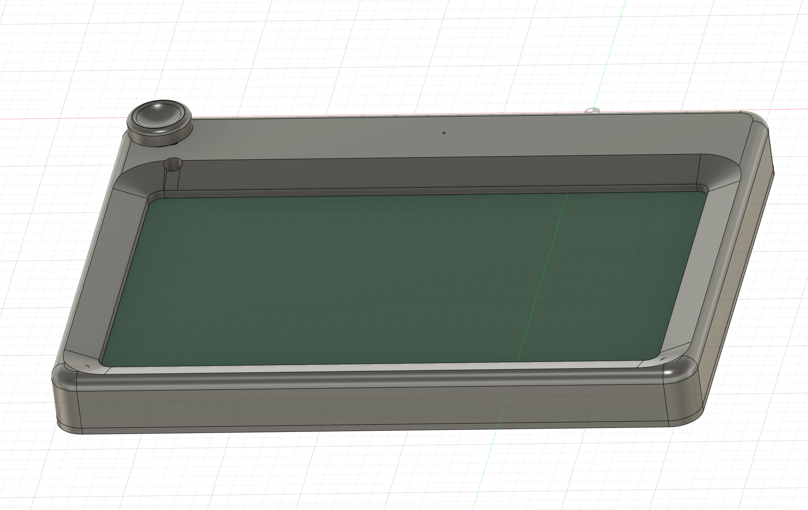
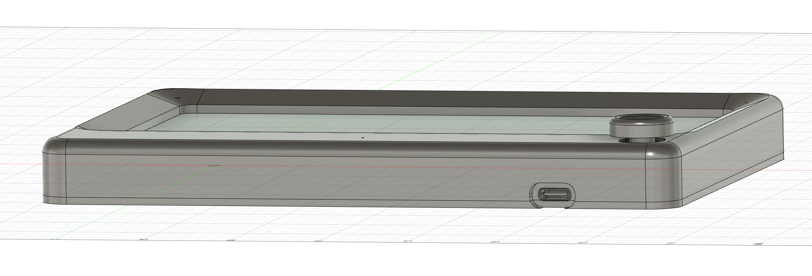
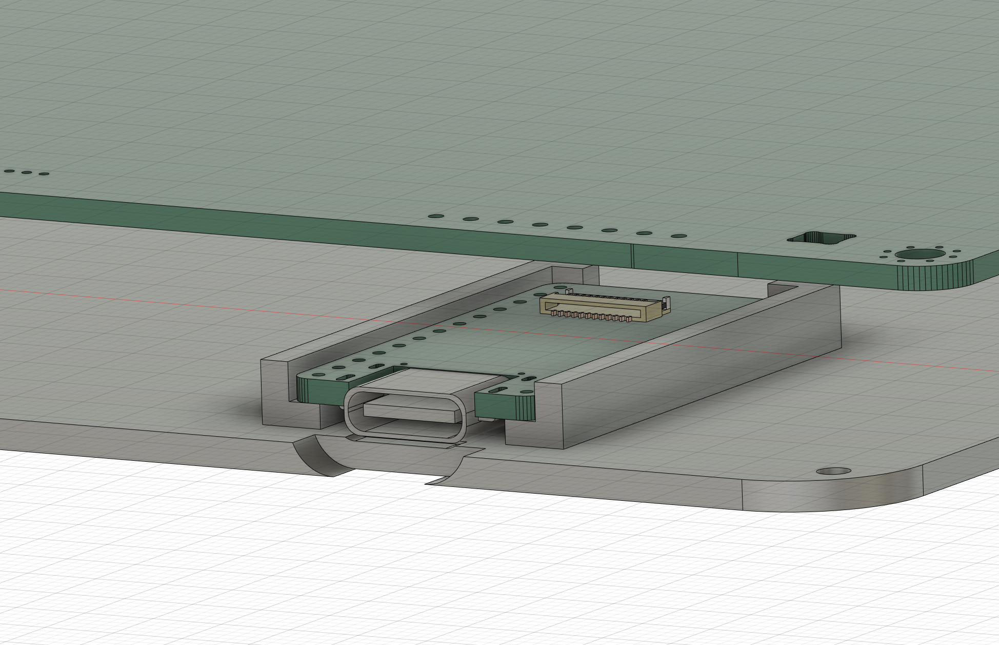
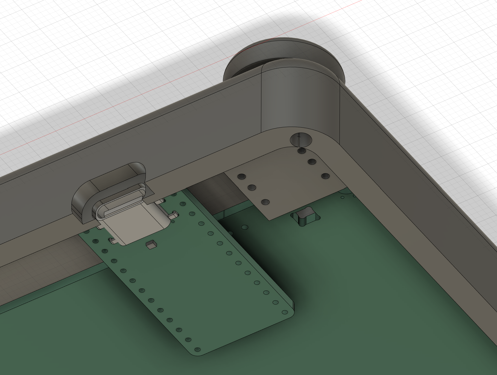
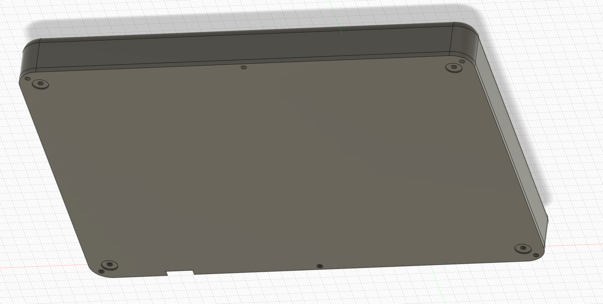

Case for a pro micro compatible controller for VIK connection to the [Peacock trackpad](https://github.com/george-norton/peacock)

# Parts

* Peacock VIK module (don't need the controller for this)
* 8x 3.5mm-4mm diameter M2 heat set inserts, height 3.5mm-4mm (but 3.5mm preferred)
* 4x M2 washers (to mount the peacock to the case body)
* 8x M2 screws, 4mm-5mm length
* VIK compatible controller
* (optional) 10mm by 10mm by 10mm multi directional 5 way switch ( https://www.aliexpress.us/item/2255800495245720.html )
* (optional) uses 6.5mm bump ons on the bottom plate, but can make custom height adjustment by using screw holes

Note that the 5 way switch must be hand wired to the controller

# Images

